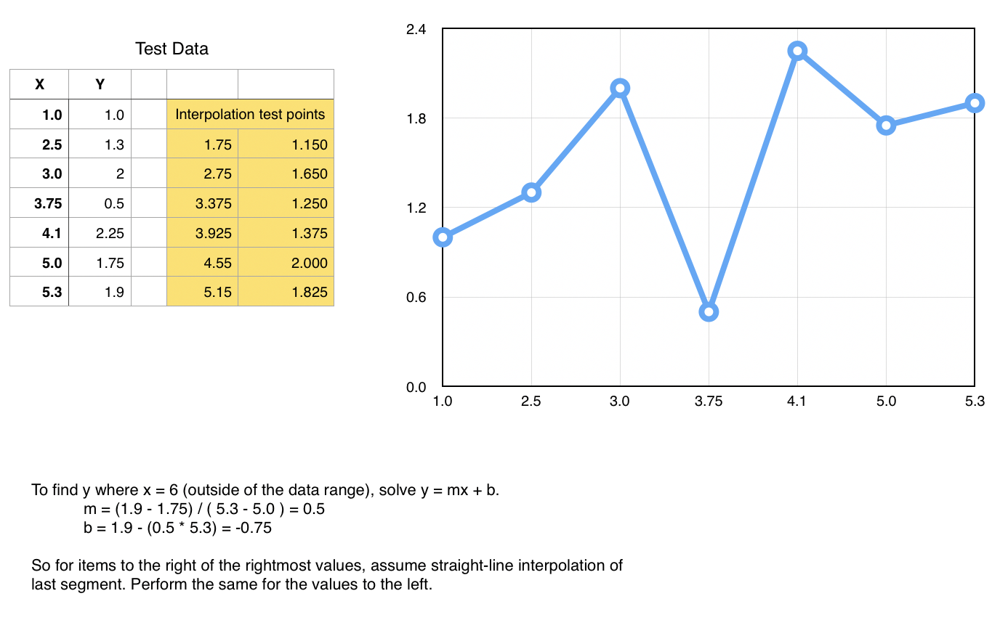

# simpleTools::interpolation
C++ interpolation class; simple, linear, exception-safe code that interpolates values in a table. Only a single header is needed.

To use, pass your table into class constructor & then use ```getY( x ). getY()``` computes the best match between any pair of points in the input table. If x is outside of the bounds of the table, ```getY()``` uses the 1st or last pair of points with the equation 'y = mx + b' to project the result.

simpleInterpolation is exception safe. If an over/underflow occurs, the C++ ```nan``` is returned.

Please refer to the unit tests. The chart below is used to support test cases.



Build instructions:<p>
&nbsp;&nbsp;&nbsp;&nbsp;```g++ -std=c++11 simpleInterpolationTest.cpp```<p>
Successfully built and tested on Mac OSX, Raspberry Pi
